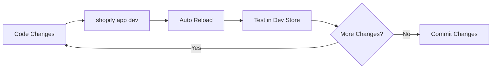

export const metadata = {
  title: 'Chuẩn bị kiến thức và công cụ phát triển Shopify App',
  description: 'Hướng dẫn chi tiết cách chuẩn bị môi trường phát triển, cài đặt công cụ và kiến thức cần thiết để xây dựng Shopify App.',
}

# Chuẩn bị kiến thức và công cụ phát triển Shopify App

## Giới thiệu

Trước khi bắt đầu xây dựng Shopify App đầu tiên, bạn cần chuẩn bị kiến thức nền tảng và cài đặt các công cụ cần thiết. Bài viết này sẽ hướng dẫn bạn từ con số 0 đến khi sẵn sàng code.

---

## Kiến thức cần có

### 1. Backend Development Basics

**Tại sao cần?**
- Xử lý authentication (OAuth)
- API endpoints
- Webhook handlers
- Business logic

**Công nghệ chính:**
- **Node.js** (Runtime)
- **TypeScript** (Để code an toàn hơn)
- **JavaScript ES6+** (Async/await, destructuring, modules)

**Khái niệm cần hiểu:**

```typescript
// 1. Async/Await cho API calls
async function fetchShopData(shop: string) {
  const response = await fetch(`https://${shop}/admin/api/2024-01/products.json`);
  const data = await response.json();
  return data;
}

// 2. Destructuring
const { shop, accessToken } = session;

// 3. Modules
import { authenticate } from "./shopify.server";
export { loader };

// 4. Error handling
try {
  const result = await someOperation();
} catch (error) {
  console.error('Error:', error);
}
```

**Tài liệu học:**
- [TypeScript Handbook](https://www.typescriptlang.org/docs/handbook/intro.html)
- [Node.js Documentation](https://nodejs.org/docs/latest-v20.x/api/)
- [Modern JavaScript Tutorial](https://javascript.info/)

### 2. Frontend Development Basics

**Tại sao cần?**
- Xây dựng Admin UI cho merchant
- Forms và settings
- Dashboard và analytics

**Công nghệ chính:**
- **React** (UI library)
- **Remix** (Full-stack framework - Shopify recommend)
- **Shopify Polaris** (Design system)

**Khái niệm cần hiểu:**

```tsx
// 1. Component
function WelcomeCard({ shopName }: { shopName: string }) {
  return (
    <Card>
      <p>Welcome to your store, {shopName}!</p>
    </Card>
  );
}

// 2. State management với hooks
function ConfigPage() {
  const [config, setConfig] = useState({
    enabled: false,
    buttonColor: '#000000'
  });

  const handleChange = (value: string) => {
    setConfig(prev => ({ ...prev, buttonColor: value }));
  };

  return <ColorPicker value={config.buttonColor} onChange={handleChange} />;
}
```

**Tài liệu học:**
- [React Documentation](https://react.dev/learn)
- [Remix Documentation](https://remix.run/docs)
- [Polaris Components](https://polaris.shopify.com/components)

### 3. Database Basics

**Tại sao cần?**
- Lưu configuration cho mỗi shop
- Store app data
- Analytics và tracking

**MongoDB thường dùng nhất vì:**
- NoSQL - flexible schema
- Easy scaling
- Good for Shopify app data model

**Khái niệm cần hiểu:**

```typescript
// 1. Schema design
interface Config {
  shop: string;           // Unique identifier
  settings: {
    enabled: boolean;
    buttonColor: string;
    position: 'top' | 'bottom';
  };
  createdAt: Date;
  updatedAt: Date;
}

// 2. CRUD operations
// Create
await Config.create({ shop: 'test.myshopify.com', settings: {...} });

// Read
const config = await Config.findOne({ shop: 'test.myshopify.com' });

// Update
await Config.updateOne({ shop: 'test.myshopify.com' }, { $set: {...} });

// Delete
await Config.deleteOne({ shop: 'test.myshopify.com' });
```

**Tài liệu học:**
- [MongoDB University](https://university.mongodb.com/)
- [Mongoose Documentation](https://mongoosejs.com/docs/guide.html)

### 4. Git & Version Control

**Tại sao cần?**
- Track changes
- Collaboration
- Deployment

**Commands cơ bản:**
```bash
git init                    # Khởi tạo repo
git add .                   # Stage all changes
git commit -m "message"     # Commit changes
git push origin main        # Push to remote
git pull origin main        # Pull latest changes
```

---

## Công cụ cần cài đặt

### 1. Shopify CLI

**Công cụ chính thức từ Shopify** để develop, test, và deploy apps.

**Cài đặt:**

```bash
# Mac
npm install -g @shopify/cli @shopify/theme

# Windows
npm install -g @shopify/cli @shopify/theme

# Verify installation
shopify version
```

**Các commands chính:**
```bash
shopify app init          # Tạo app mới
shopify app dev           # Start development server
shopify app deploy        # Deploy app
shopify app generate      # Generate resources
```

**Documentation:** [Shopify CLI Reference](https://shopify.dev/docs/apps/tools/cli)

### 2. Node.js & npm

**Node.js** là runtime để chạy JavaScript backend.
**npm** là package manager để install dependencies.

**Cài đặt:**
- Download từ [nodejs.org](https://nodejs.org/) (LTS version recommended)
- Hoặc dùng [nvm](https://github.com/nvm-sh/nvm) để quản lý multiple versions

```bash
# Verify
node --version   # Should be v18.20+ or v20.10+
npm --version    # Should be 9.0+
```

**Alternative:** pnpm (nhanh hơn npm)
```bash
npm install -g pnpm
```

### 3. Code Editor

**VS Code** là lựa chọn tốt nhất với nhiều extensions:

```bash
# Install VS Code
# Mac
brew install --cask visual-studio-code

# Windows
# Download from code.visualstudio.com
```

**Extensions cần thiết:**
```
- ESLint                    # Code linting
- Prettier                  # Code formatting
- Shopify CLI               # Syntax highlighting cho Liquid
- TypeScript                # TypeScript support
- Tailwind CSS IntelliSense # Nếu dùng Tailwind
```

### 4. Git

```bash
# Mac
brew install git

# Windows
# Download từ git-scm.com

# Verify
git --version
```

---

## Tài khoản cần thiết

### 1. Shopify Partner Account

**Tại sao cần?**
- Create development stores
- Build and test apps
- Submit apps to App Store
- Receive payments

**Đăng ký:**
1. Truy cập [partners.shopify.com](https://partners.shopify.com/)
2. Click "Become a Partner"
3. Fill in information
4. Verify email

**Dashboard features:**
- Development Stores (tạo store để test)
- Apps (manage apps)
- Organizations (team collaboration)
- Analytics (app performance)

### 2. GitHub Account

**Tại sao cần?**
- Host source code
- CI/CD (GitHub Actions)
- Issue tracking
- Portfolio

**Đăng ký:** [github.com](https://github.com/signup)

### 3. Hosting Account (optional cho development)

**Options:**
- **Fly.io** (Recommended by Shopify) - Free tier available
- **Railway** - Easy deployment
- **Heroku** - Classic choice (not free anymore)
- **Vercel/Netlify** - Good for frontend

---

## Setup Development Environment

### Bước 1: Tạo Development Store

1. Login vào [Partner Dashboard](https://partners.shopify.com/)
2. Go to **Stores** → **Development stores**
3. Click **Add development store**
4. Fill in:
   - **Store name:** `your-app-dev`
   - **Store URL:** `your-app-dev.myshopify.com`
   - **Store purpose:** "Test my app"
   - **Store password:** (optional)

### Bước 2: Tạo Project Skeleton

```bash
# Create directory
mkdir shopify-apps
cd shopify-apps

# Initialize app (chọn template)
shopify app init

# CLI sẽ hỏi:
# ? App name: my-first-app
# ? Template: Remix (recommended)
```

**Cấu trúc project:**
```
my-first-app/
├── app/
│   ├── routes/           # Pages và API endpoints
│   ├── components/       # React components
│   ├── models/          # Database models
│   ├── services/        # Business logic
│   └── shopify.server.ts # Shopify config
├── public/              # Static files
├── package.json
└── shopify.app.toml     # App configuration
```

### Bước 3: Cấu hình Environment Variables

```bash
# Tạo .env file
cat > .env << EOF
SHOPIFY_API_KEY=your_api_key
SHOPIFY_API_SECRET=your_api_secret
SHOPIFY_APP_URL=https://your-app-url.com
SCOPES=write_products,read_themes,write_themes
DATABASE_URL=mongodb://...
REDIS_URL=redis://...
EOF

# Add to .gitignore
echo ".env" >> .gitignore
```

### Bước 4: Install Dependencies

```bash
# Với npm
npm install

# Với pnpm
pnpm install

# Hoặc yarn
yarn install
```

**Dependencies phổ biến cho Shopify App:**
```json
{
  "dependencies": {
    "@remix-run/node": "^2.16.1",
    "@remix-run/react": "^2.16.1",
    "@shopify/polaris": "^13.9.5",
    "@shopify/shopify-app-remix": "^3.8.5",
    "mongoose": "^8.19.2",
    "redis": "^5.9.0",
    "zod": "^4.1.12"
  }
}
```

---

## Development Workflow

### Local Development

```bash
# Start development server
shopify app dev

# CLI sẽ:
# 1. Start local server (http://localhost:3456)
# 2. Create tunnel (ngrok/Cloudflare)
# 3. Update app URL in Shopify
# 4. Open browser for installation
```

**Workflow:**


### Testing

```bash
# Run tests
npm test

# Run with coverage
npm run test:coverage

# Watch mode
npm run test:watch
```

### Deployment Preview

```bash
# Deploy to preview
shopify app deploy --preview

# Hoặc
shopify app deploy --message="Testing feature X"
```

---

## Package.json tham khảo

```json
{
  "name": "your-shopify-app",
  "version": "1.0.0",
  "private": true,
  "scripts": {
    "build": "remix vite:build",
    "dev": "remix vite:dev",
    "shopify:dev": "shopify app dev",
    "deploy": "shopify app deploy",
    "lint": "eslint --cache --cache-location ./node_modules/.cache/eslint .",
    "test": "vitest run",
    "test:watch": "vitest",
    "test:coverage": "vitest run --coverage"
  },
  "dependencies": {
    "@remix-run/dev": "^2.16.1",
    "@remix-run/node": "^2.16.1",
    "@remix-run/react": "^2.16.1",
    "@shopify/polaris": "^13.9.5",
    "@shopify/polaris-icons": "^9.3.1",
    "@shopify/shopify-app-remix": "^3.8.5",
    "@shopify/shopify-app-session-storage-redis": "^4.2.13",
    "isbot": "^5.1.0",
    "mongoose": "^8.19.2",
    "react": "^18.2.0",
    "react-dom": "^18.2.0",
    "redis": "^5.9.0",
    "vite-tsconfig-paths": "^5.0.1",
    "zod": "^4.1.12"
  },
  "devDependencies": {
    "@remix-run/eslint-config": "^2.16.1",
    "@types/node": "^22.18.13",
    "@types/react": "^18.2.31",
    "@types/react-dom": "^18.2.14",
    "@vitest/coverage-v8": "^4.0.6",
    "eslint": "^8.42.0",
    "typescript": "^5.2.2",
    "vite": "^6.2.2",
    "vitest": "^4.0.6"
  }
}
```

---

## Common Issues & Solutions

### Issue 1: "shopify: command not found"

**Solution:**
```bash
# Reinstall CLI
npm uninstall -g @shopify/cli
npm install -g @shopify/cli

# Verify
shopify version
```

### Issue 2: Port already in use

**Solution:**
```bash
# Kill process on port
# Mac
lsof -ti:3456 | xargs kill

# Windows
netstat -ano | findstr :3456
taskkill /PID <PID> /F

# Or specify different port
shopify app dev --port=3457
```

### Issue 3: MongoDB connection failed

**Solution:**
```bash
# Check MongoDB is running
# Mac
brew services start mongodb-community

# Windows
net start MongoDB

# Verify connection
mongosh "mongodb://localhost:27017"
```

---

## Checklist trước khi bắt đầu

- [ ] Node.js v18+ installed
- [ ] Shopify CLI installed và working
- [ ] VS Code với extensions cần thiết
- [ ] Shopify Partner account created
- [ ] Development store created
- [ ] GitHub account created
- [ ] Git configured
- [ ] Hosting account (optional)
- [ ] MongoDB installed/local hoặc Atlas account
- [ ] Redis installed/local hoặc Redis Cloud account

---

## Key Takeaways

1. **Kiến thức cần thiết:**
   - Backend (Node.js/TypeScript)
   - Frontend (React/Remix)
   - Database (MongoDB)
   - Git/Version Control

2. **Công cụ bắt buộc:**
   - Shopify CLI
   - Node.js & npm/pnpm
   - VS Code
   - Git

3. **Tài khoản cần thiết:**
   - Shopify Partner (để test và deploy)
   - GitHub (để host code)
   - Hosting (để deploy production)

4. **Development workflow:**
   - Code locally
   - Test with `shopify app dev`
   - Deploy when ready

---

## Tài nguyên tham khảo

**Official Resources:**
- [Shopify CLI Documentation](https://shopify.dev/docs/apps/tools/cli)
- [Partner Dashboard](https://partners.shopify.com/)
- [Development Stores Guide](https://help.shopify.com/en/manual/your-account/development-stores)

**Learning Resources:**
- [TypeScript Deep Dive](https://basarat.gitbook.io/typescript/)
- [React Tutorial](https://react.dev/learn)
- [Remix Tutorial](https://remix.run/docs/en/main/start/tutorial)

**Community:**
- [Shopify Devs Discord](https://discord.gg/shopify)
- [Shopify Community](https://community.shopify.com/c/shopify-apps)

---

## Tiếp theo là gì?

Trong **Phần 3**, tôi sẽ hướng dẫn:
- Tạo project Shopify App đầu tiên
- Hiểu cấu trúc project
- Cấu hình shopify.app.toml
- Chạy app locally với development store

[Đọc Phần 3: Tạo project Shopify App đầu tiên →](/blog/tao-project-shopify-app-dau-tien)

[← Quay lại Phần 1: Shopify App là gì?](/blog/shopify-app-la-gi)
