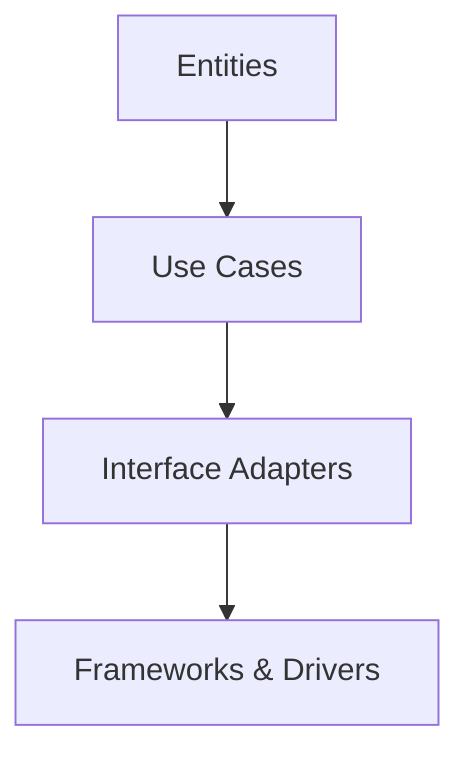

export const metadata = {
  title: 'Clean Architecture là gì?',
  description: 'Clean Architecture là một mẫu kiến trúc phần mềm giúp tạo ra các ứng dụng dễ bảo trì, linh hoạt và độc lập với framework. Tìm hiểu về các nguyên tắc, lợi ích và cách áp dụng Clean Architecture.',
}

# Clean Architecture là gì?

## Giới thiệu

Clean Architecture là một mẫu kiến trúc phần mềm được giới thiệu bởi Robert C. Martin (Uncle Bob). Kiến trúc này nhằm tạo ra các hệ thống có tính:
- Độc lập với framework
- Dễ kiểm thử
- Độc lập với UI
- Độc lập với cơ sở dữ liệu
- Độc lập với bất kỳ yếu tố bên ngoài nào

## Các lớp trong Clean Architecture

### 1. Entities (Lớp thực thể)
- Chứa các business rules cốt lõi của ứng dụng
- Có thể được sử dụng bởi nhiều ứng dụng khác nhau
- Ít có khả năng thay đổi khi có yêu cầu bên ngoài
- Không phụ thuộc vào bất kỳ lớp nào khác

### 2. Use Cases (Lớp ca sử dụng)
- Chứa các business rules cụ thể cho ứng dụng
- Điều phối luồng dữ liệu đến và đi từ entities
- Không quan tâm đến cách dữ liệu được lưu trữ hoặc hiển thị
- Chỉ phụ thuộc vào lớp entities

### 3. Interface Adapters
- Chuyển đổi dữ liệu từ use cases và entities sang định dạng thuận tiện
- Bao gồm presenters, controllers, và gateways
- Không chứa business rules
- Phụ thuộc vào use cases

### 4. Frameworks & Drivers (Lớp ngoài cùng)
- Chứa các chi tiết triển khai
- Framework, tools, và delivery mechanisms
- Database, Web Framework, UI, etc.
- Lớp có nhiều thay đổi nhất

## Nguyên tắc cơ bản

### 1. Dependency Rule
- Các dependencies chỉ có thể hướng vào trong
- Lớp bên trong không biết gì về lớp bên ngoài
- Lớp bên ngoài phải tuân theo interface của lớp bên trong

### 2. Dependency Inversion
- Các module cấp cao không phụ thuộc vào module cấp thấp
- Cả hai đều phụ thuộc vào abstraction
- Abstraction không phụ thuộc vào chi tiết

### 3. Separation of Concerns
- Tách biệt các thành phần theo chức năng
- Mỗi lớp có trách nhiệm riêng biệt
- Giảm thiểu sự phụ thuộc giữa các thành phần

## Lợi ích

### 1. Maintainability (Khả năng bảo trì)
- Dễ dàng thay đổi và mở rộng
- Code có cấu trúc rõ ràng
- Giảm thiểu technical debt
- Dễ dàng refactor

### 2. Testability (Khả năng kiểm thử)
- Dễ dàng viết unit tests
- Không cần nhiều mocks
- Có thể test business logic độc lập
- Coverage cao hơn

### 3. Independence (Tính độc lập)
- Độc lập với framework
- Độc lập với UI
- Độc lập với database
- Dễ dàng thay đổi công nghệ

### 4. Flexibility (Tính linh hoạt)
- Dễ dàng thích ứng với thay đổi
- Có thể phát triển nhiều features song song
- Dễ dàng tích hợp công nghệ mới
- Tái sử dụng code tốt hơn

## Khi nào nên sử dụng Clean Architecture?

### 1. Dự án phức tạp
- Có nhiều business rules
- Cần độ tin cậy cao
- Nhiều người cùng phát triển
- Kỳ vọng phát triển lâu dài

### 2. Yêu cầu thay đổi thường xuyên
- UI có thể thay đổi
- Database có thể thay đổi
- External services có thể thay đổi
- Business rules ít thay đổi

### 3. Cần tính linh hoạt cao
- Có thể thay đổi công nghệ
- Dễ dàng mở rộng
- Tái sử dụng code
- Dễ dàng maintain

## Kết luận

Clean Architecture là một mẫu kiến trúc mạnh mẽ giúp tạo ra các ứng dụng có khả năng mở rộng và bảo trì tốt. Mặc dù có thể mất nhiều thời gian hơn trong giai đoạn đầu, nhưng lợi ích lâu dài mà nó mang lại là rất đáng giá, đặc biệt là đối với các dự án lớn và phức tạp. 