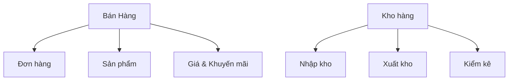

export const metadata = {
  title: 'Domain-Driven Design (DDD) là gì?',
  description: 'Domain-Driven Design là một phương pháp thiết kế phần mềm giúp xây dựng các ứng dụng phức tạp dễ hiểu và dễ bảo trì hơn.',
}

# Domain-Driven Design (DDD) là gì?

## Giới thiệu đơn giản

Domain-Driven Design (DDD) là cách tiếp cận để phát triển phần mềm bằng việc:
1. Tập trung vào nghiệp vụ cốt lõi của doanh nghiệp (domain)
2. Tạo ra mô hình phần mềm dễ hiểu với mọi người
3. Đảm bảo code phản ánh đúng quy trình nghiệp vụ thực tế

Ví dụ: Khi xây dựng hệ thống bán hàng, thay vì chỉ tập trung vào database hay UI, DDD giúp bạn tập trung vào các khái niệm nghiệp vụ như:
- Đơn hàng (Order)
- Sản phẩm (Product)  
- Khách hàng (Customer)
- Quy trình đặt hàng
- Chính sách giá
- Quy tắc khuyến mãi

## Tại sao cần DDD?

### 1. Vấn đề thường gặp khi phát triển phần mềm
- Developer không hiểu rõ nghiệp vụ
- Người dùng không hiểu code
- Code không phản ánh đúng quy trình thực tế
- Khó thay đổi khi nghiệp vụ thay đổi

### 2. Cách DDD giải quyết
- Tạo ngôn ngữ chung giữa developer và người dùng
- Code được tổ chức theo nghiệp vụ thực tế
- Dễ dàng thay đổi khi quy trình thay đổi

## Các khái niệm chính trong DDD

### 1. Domain (Nghiệp vụ)
Là lĩnh vực mà phần mềm đang giải quyết.

Ví dụ trong hệ thống bán hàng:
- Domain chính: Bán hàng
- Sub-domains: 
  + Quản lý kho
  + Thanh toán
  + Vận chuyển
  + Chăm sóc khách hàng

### 2. Ubiquitous Language (Ngôn ngữ chung)
Là cách gọi thống nhất cho các khái niệm trong hệ thống.

Ví dụ:
```typescript
// Không tốt: Tên gọi không thống nhất
class CustomerInfo {} 
class ClientData {}
class UserRecord {}

// Tốt: Dùng một tên gọi thống nhất
class Customer {}
```

### 3. Bounded Context (Phạm vi nghiệp vụ)
Là cách chia nhỏ hệ thống thành các phần có nghiệp vụ riêng biệt.

Ví dụ hệ thống bán hàng:


## Các thành phần cơ bản

### 1. Entity (Thực thể)
Là đối tượng có định danh duy nhất.

Ví dụ:
```typescript
class Order {
  private orderId: string;
  private items: OrderItem[];
  private status: OrderStatus;

  placeOrder() {
    // Logic đặt hàng
  }

  cancel() {
    // Logic hủy đơn
  }
}
```

### 2. Value Object (Đối tượng giá trị)
Là đối tượng không cần ID, chỉ quan tâm đến giá trị.

Ví dụ:
```typescript
class Address {
  constructor(
    private street: string,
    private city: string,
    private country: string
  ) {}

  toString() {
    return `${this.street}, ${this.city}, ${this.country}`;
  }
}
```

### 3. Aggregate (Tập hợp)
Là nhóm các entities và value objects liên quan.

Ví dụ:
```typescript
class Order { // Aggregate Root
  private orderId: string;
  private customer: Customer;
  private items: OrderItem[];
  private shippingAddress: Address;
  private billingAddress: Address;

  addItem(product: Product, quantity: number) {
    // Kiểm tra và thêm sản phẩm
  }

  calculateTotal() {
    // Tính tổng tiền
  }
}
```

## Ví dụ thực tế

### Hệ thống bán hàng đơn giản

```typescript
// Domain Events
interface OrderPlaced {
  orderId: string;
  customerId: string;
  items: OrderItem[];
  totalAmount: Money;
  placedAt: Date;
}

// Value Objects
class Money {
  constructor(
    private amount: number,
    private currency: string = 'VND'
  ) {
    if (amount < 0) {
      throw new Error('Số tiền không được âm');
    }
  }

  add(other: Money): Money {
    if (this.currency !== other.currency) {
      throw new Error('Không thể cộng hai loại tiền tệ khác nhau');
    }
    return new Money(this.amount + other.amount, this.currency);
  }
}

class OrderItem {
  constructor(
    private product: Product,
    private quantity: number,
    private unitPrice: Money
  ) {
    if (quantity <= 0) {
      throw new Error('Số lượng phải lớn hơn 0');
    }
  }

  getSubtotal(): Money {
    return new Money(this.unitPrice.amount * this.quantity);
  }
}

// Entity (Aggregate Root)
class Order {
  private id: string;
  private customerId: string;
  private items: OrderItem[] = [];
  private status: OrderStatus = OrderStatus.Draft;
  private createdAt: Date;

  constructor(id: string, customerId: string) {
    this.id = id;
    this.customerId = customerId;
    this.createdAt = new Date();
  }

  addItem(product: Product, quantity: number) {
    if (this.status !== OrderStatus.Draft) {
      throw new Error('Không thể thêm sản phẩm vào đơn đã xác nhận');
    }
    
    const existingItem = this.items.find(item => 
      item.productId === product.id
    );

    if (existingItem) {
      throw new Error('Sản phẩm đã có trong đơn hàng');
    }
    
    const item = new OrderItem(product, quantity, product.getPrice());
    this.items.push(item);
  }

  calculateTotal(): Money {
    return this.items.reduce(
      (total, item) => total.add(item.getSubtotal()),
      new Money(0)
    );
  }

  place(): OrderPlaced {
    if (this.items.length === 0) {
      throw new Error('Đơn hàng phải có ít nhất 1 sản phẩm');
    }

    this.status = OrderStatus.Placed;
    
    return {
      orderId: this.id,
      customerId: this.customerId,
      items: this.items,
      totalAmount: this.calculateTotal(),
      placedAt: new Date()
    };
  }
}
```

## Khi nào nên dùng DDD?

### Nên dùng khi:
- Nghiệp vụ phức tạp (ví dụ: hệ thống bảo hiểm, ngân hàng)
- Cần trao đổi nhiều với chuyên gia nghiệp vụ
- Dự án dài hạn, cần bảo trì lâu dài
- Team lớn cần phối hợp hiệu quả

### Không cần dùng khi:
- Ứng dụng đơn giản (ví dụ: blog, landing page)
- Nghiệp vụ đơn giản, ít thay đổi
- Dự án nhỏ, thời gian ngắn
- Team nhỏ, một người làm chủ yếu

## Kết luận

DDD là cách tiếp cận hiệu quả để xây dựng phần mềm phức tạp bằng cách:
1. Tập trung vào nghiệp vụ thực tế
2. Tạo ngôn ngữ chung giữa developer và người dùng
3. Tổ chức code theo cách dễ hiểu và dễ thay đổi

Mặc dù có thể mất nhiều thời gian ban đầu, nhưng DDD sẽ giúp dự án dễ phát triển và bảo trì hơn trong dài hạn. 