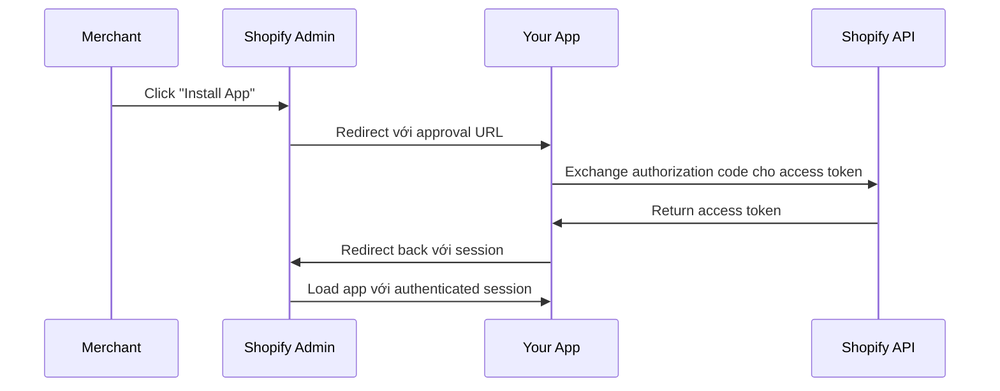

export const metadata = {
  title: 'Authentication & Authorization trong Shopify App - Hướng dẫn chi tiết',
  description: 'Tìm hiểu về OAuth flow, session management, access tokens và securing Shopify App của bạn.',
}

# Authentication & Authorization trong Shopify App

## Giới thiệu

Authentication là hàng rào bảo vệ đầu tiên cho Shopify App của bạn. Bài viết này sẽ giải thích cách Shopify OAuth hoạt động và cách implement secure authentication.

---

## Shopify OAuth Flow

### Overview

Khi merchant cài đặt app của bạn, Shopify sẽ redirect họ qua app để xác thực quyền truy cập.



### Chi tiết từng bước

**1. Merchant click "Install App"**

```
https://{shop}.myshopify.com/admin/apps/your-app
```

**2. Shopify redirect đến app với approval URL**

```
https://your-app.com/auth?shop={shop}&timestamp={timestamp}&hmac={signature}
```

**3. App validate request và redirect đến OAuth screen**

```
https://{shop}.myshopify.com/admin/oauth/authorize?
  client_id={api_key}
  &scope={scopes}
  &redirect_uri={your-app.com/auth/callback}
  &state={nonce}
  &response_type=code
```

**4. Merchant approve scopes**

**5. Shopify redirect với authorization code**

```
https://your-app.com/auth/callback?
  shop={shop}
  &code={authorization_code}
  &state={nonce}
  &hmac={signature}
```

**6. App exchange code cho access token**

```typescript
const response = await fetch(
  `https://${shop}.myshopify.com/admin/oauth/access_token`,
  {
    method: "POST",
    body: JSON.stringify({
      client_id: apiKey,
      client_secret: apiSecret,
      code: authorizationCode
    })
  }
);

const { access_token } = await response.json();
```

**7. App lưu session và redirect merchant đến app UI**

---

## Implementation với Shopify App Remix

### shopify.server.ts Configuration

```typescript
import "@shopify/shopify-app-remix/adapters/node";
import {
  ApiVersion,
  AppDistribution,
  shopifyApp,
} from "@shopify/shopify-app-remix/server";
import { RedisSessionStorage } from "@shopify/shopify-app-session-storage-redis";
import { PrismaSessionStorage } from "@shopify/shopify-app-session-storage-prisma";

const shopify = shopifyApp({
  apiKey: process.env.SHOPIFY_API_KEY,
  apiSecretKey: process.env.SHOPIFY_API_SECRET,
  apiVersion: ApiVersion.January25,

  // Scopes cần thiết
  scopes: {
    // Chỉ request scopes bạn cần
    default: ["write_products", "read_themes", "write_themes"],
  },

  // App URL
  appUrl: process.env.SHOPIFY_APP_URL,

  // Authentication path
  authPathPrefix: "/auth",

  // Session storage
  sessionStorage: new RedisSessionStorage({
    url: process.env.REDIS_URL,
    prefix: "shopify_app_sessions"
  }),

  // Distribution (App Store hay Custom)
  distribution: AppDistribution.AppStore,

  // Hooks
  hooks: {
    // Sau khi merchant install app
    afterAuth: async ({ admin, session }) => {
      const shop = session.shop;

      // Setup database records
      await setupStore(shop, admin);

      // Sync initial data
      await syncShopData(shop, admin);

      console.log(`App installed for ${shop}`);
    },
  },

  // Future features
  future: {
    unstable_newEmbeddedAuthStrategy: true,
    removeRest: true,
  },
});

export default shopify;
export const authenticate = shopify.authenticate;
export const unauthenticated = shopify.unauthenticated;
```

### Session Storage Options

**1. Redis (Recommended cho production)**

```typescript
import { RedisSessionStorage } from "@shopify/shopify-app-session-storage-redis";

const sessionStorage = new RedisSessionStorage({
  url: process.env.REDIS_URL,
  prefix: "shopify_app_sessions",
  // Optional: Custom Redis instance
  // redis: redisClient
});
```

**2. MongoDB/Prisma**

```typescript
import { PrismaSessionStorage } from "@shopify/shopify-app-session-storage-prisma";

const sessionStorage = new PrismaSessionStorage(prisma);
```

**3. Memory (Chỉ cho development)**

```typescript
import { MemorySessionStorage } from "@shopify/shopify-app-session-storage-memory";

const sessionStorage = new MemorySessionStorage();
```

---

## Scopes - Quyền truy cập App

### Scopes phổ biến

| Scope | Mô tả | Use case |
|-------|-------|----------|
| `write_products` | Đọc/viết products | Product management apps |
| `read_products` | Đọc products | Analytics apps |
| `write_orders` | Đọc/viết orders | Order management |
| `read_orders` | Đọc orders | Reporting apps |
| `write_customers` | Đọc/viết customers | CRM apps |
| `write_inventory` | Quản lý inventory | Inventory apps |
| `read_themes` | Đọc theme files | Theme apps |
| `write_themes` | Ghi theme files | Apps inject code |
| `write_script_tags` | Thêm script tags | Apps inject JS |

### Best Practices

```typescript
// ❌ BAD: Request quá nhiều scopes
scopes: "write_products,write_orders,write_customers,write_inventory,write_script_tags"

// ✅ GOOD: Chỉ request cần thiết
scopes: {
  default: ["write_products", "write_themes"],
  admin: "write_orders"  // Chỉ cho admin users
}
```

---

## Sử dụng Authentication trong Routes

### Protected Routes (Admin UI)

```tsx
// app/routes/app._index.tsx
import { json, type LoaderFunctionArgs } from "@remix-run/node";
import { useLoaderData } from "@remix-run/react";
import { authenticate } from "../shopify.server";
import { Card, Page } from "@shopify/polaris";

export const loader = async ({ request }: LoaderFunctionArgs) => {
  // Authenticate và get session
  const { session, admin } = await authenticate.admin(request);

  // Session object chứa:
  // - session.shop: Shop domain
  // - session.accessToken: API access token
  // - session.scope: Granted scopes

  const shop = session.shop;

  // Fetch data từ Shopify Admin API
  const response = await admin.graphql(`
    query {
      shop {
        name
        email
        primaryDomain { url }
      }
    }
  `);

  const { data } = await response.json();

  return json({
    shop,
    shopData: data.shop
  });
};

export default function Index() {
  const { shop, shopData } = useLoaderData<typeof loader>();

  return (
    <Page title="Dashboard">
      <Card>
        <p>Welcome to {shopData.name}</p>
        <p>Email: {shopData.email}</p>
      </Card>
    </Page>
  );
}
```

### Public API Routes

```tsx
// app/routes/api.public.tsx
import { json, type LoaderFunctionArgs } from "@remix-run/node";
import { unauthenticated } from "../shopify.server";

export const loader = async ({ request }: LoaderFunctionArgs) => {
  // Không cần authentication
  // Dùng cho webhooks, public endpoints

  return json({ message: "Public endpoint" });
};
```

---

## Webhook Authentication

Webhooks cần HMAC verification để đảm bảo request đến từ Shopify.

```tsx
// app/routes/webhooks.app.uninstalled.tsx
import { json, type ActionFunctionArgs } from "@remix-run/node";
import { authenticate } from "../shopify.server";

export const action = async ({ request }: ActionFunctionArgs) => {
  // authenticate.webhook tự động verify HMAC
  const { topic, shop, session, admin } = await authenticate.webhook(request);

  if (topic === "APP_UNINSTALLED") {
    // Session = null cho uninstall webhook
    // Dùng shop domain để cleanup

    await cleanupShopData(shop);

    return json({ success: true });
  }

  return json({ success: false });
};
```

---

## Security Best Practices

### 1. Environment Variables

```bash
# .env
SHOPIFY_API_KEY=xxx
SHOPIFY_API_SECRET=xxx
SHOPIFY_APP_URL=https://your-app.com
REDIS_URL=redis://localhost:6379
```

```typescript
// shopify.server.ts
const shopify = shopifyApp({
  apiKey: process.env.SHOPIFY_API_KEY!,
  apiSecretKey: process.env.SHOPIFY_API_SECRET!,
  // ...
});
```

### 2. HTTPS cho Production

```typescript
// Force HTTPS trong production
if (process.env.NODE_ENV === "production") {
  app.use((req, res, next) => {
    if (req.header("x-forwarded-proto") !== "https") {
      res.redirect(`https://${req.header("host")}${req.url}`);
    } else {
      next();
    }
  });
}
```

### 3. Session Validation

```typescript
// Middleware để validate session
export async function requireShop(
  request: Request
): Promise<{ shop: string; admin: AdminApiContext }> {
  const { session, admin } = await authenticate.admin(request);

  if (!session) {
    throw redirect("/auth/login");
  }

  return { shop: session.shop, admin };
}
```

### 4. Rate Limiting

```typescript
// Rate limit API calls
import { redis } from "../redis.server";

async function checkRateLimit(shop: string) {
  const key = `ratelimit:${shop}`;
  const count = await redis.incr(key);

  if (count === 1) {
    await redis.expire(key, 60); // 1 minute window
  }

  if (count > 100) {
    throw new Error("Rate limit exceeded");
  }
}
```

---

## Real-world Example

```typescript
// shopify.server.ts từ sticky-add-to-cart
import "@shopify/shopify-app-remix/adapters/node";
import {
  ApiVersion,
  AppDistribution,
  shopifyApp,
} from "@shopify/shopify-app-remix/server";
import { RedisSessionStorage } from "@shopify/shopify-app-session-storage-redis";
import { connectToMongoDB } from "./mongoose.server";
import * as configRepository from "./repositories/config.repository";
import * as storeRepository from "./repositories/store.repository";

connectToMongoDB();

const shopify = shopifyApp({
  apiKey: process.env.SHOPIFY_API_KEY,
  apiSecretKey: process.env.SHOPIFY_API_SECRET,
  apiVersion: ApiVersion.January25,
  scopes: process.env.SCOPES.split(","),
  appUrl: process.env.SHOPIFY_APP_URL,
  authPathPrefix: "/auth",
  sessionStorage: new RedisSessionStorage(process.env.REDIS_URL),
  distribution: AppDistribution.AppStore,
  hooks: {
    afterAuth: async ({ admin, session }) => {
      const shop = session.shop;

      // Create store record nếu chưa có
      await storeRepository.findOrCreate(shop);

      // Create config record
      await configRepository.findOrCreate(shop);

      console.log(`Setup complete for ${shop}`);
    },
  },
  future: {
    unstable_newEmbeddedAuthStrategy: true,
    removeRest: true,
  },
});

export default shopify;
export const authenticate = shopify.authenticate;
```

---

## Testing Authentication

### Test với Development Store

```bash
# Start dev server
shopify app dev

# CLI sẽ:
# 1. Start tunnel
# 2. Update app URL
# 3. Prompt for installation
```

### Test Session Expiry

```typescript
// Test session expiry manually
await sessionStorage.deleteSession(sessionId);
```

---

## Common Issues

### Issue: "Invalid HMAC signature"

**Solution:**
- Verify API secret key
- Check request parameters
- Ensure timestamps are valid (5 minute window)

### Issue: "Session not found"

**Solution:**
- Check Redis connection
- Verify session storage configuration
- Check session TTL settings

### Issue: "Access denied"

**Solution:**
- Verify scopes are requested
- Check merchant approved all required scopes
- Review API permissions in Partner Dashboard

---

## Key Takeaways

1. **OAuth flow** bảo vệ app và xác thực merchant
2. **Session storage** (Redis/MongoDB) lưu authentication state
3. **Scopes** định nghĩa quyền truy cập - chỉ request cần thiết
4. **authenticate.admin()** bảo vệ admin routes
5. **authenticate.webhook()** verify webhook HMAC signatures

---

## Tài nguyên tham khảo

- [Shopify OAuth Documentation](https://shopify.dev/docs/apps/auth)
- [Session Tokens](https://shopify.dev/docs/apps/auth/session-tokens)
- [API Scopes](https://shopify.dev/docs/api/alignment/access-scopes)

---

## Next Steps

Trong **Phần 5**, bạn sẽ học:
- Remix framework chi tiết
- Shopify Polaris components
- Xây dựng Admin UI
- Loaders và Actions

[Đọc Phần 5: Xây dựng Admin UI với Remix và Polaris →](/blog/xay-dung-admin-ui-remix-polaris)

[← Quay lại Phần 3: Tạo project đầu tiên](/blog/tao-project-shopify-app-dau-tien)
