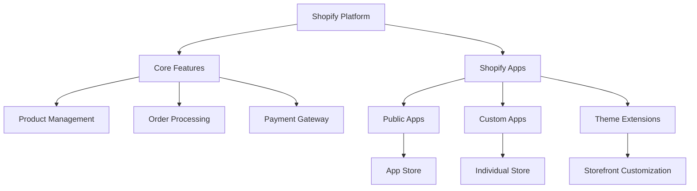
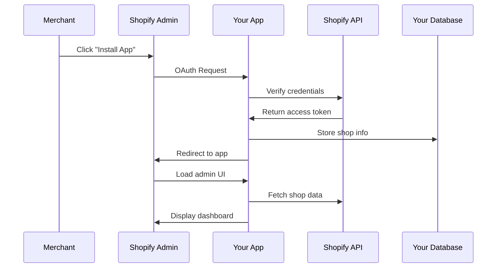

export const metadata = {
  title: 'Shopify App là gì? Hướng dẫn chi tiết cho người mới bắt đầu',
  description: 'Tìm hiểu về Shopify App, các loại app, lợi ích và cách kiếm tiền từ việc phát triển ứng dụng cho nền tảng Shopify.',
}

# Shopify App là gì? Hướng dẫn chi tiết cho người mới bắt đầu

## Giới thiệu

Bạn đang nghe thấy rất nhiều về Shopify App và muốn tìm hiểu cơ hội kinh doanh từ việc phát triển ứng dụng cho nền tảng này? Bài viết này sẽ giúp bạn hiểu rõ từ cơ bản đến chuyên sâu về Shopify App.

---

## Shopify Ecosystem là gì?

Shopify là một nền tảng thương mại điện tử (e-commerce platform) cho phép các doanh nghiệp tạo cửa hàng online và bán sản phẩm. Tuy nhiên, không một nền tảng nào có thể đáp ứng tất cả nhu cầu của mọi doanh nghiệp. Đó là lý do **Shopify App** ra đời.



---

## Shopify App là gì?

**Shopify App** là một ứng dụng bên thứ ba tích hợp vào cửa hàng Shopify để mở rộng chức năng, tự động hóa quy trình hoặc cải thiện trải nghiệm khách hàng.

### Ví dụ thực tế

**Sticky Add to Cart App** - Một app mà merchant có thể cài đặt để hiển thị nút "Add to Cart" cố định khi khách hàng cuộn trang, giúp tăng tỷ lệ chuyển đổi.

Tính năng chính:
- Hiển thị nút mua hàng ở vị trí cố định
- Tự động đồng bộ với variant hiện tại
- Tùy chỉnh màu sắc, vị trí
- Hoạt động trên cả desktop và mobile

---

## Các loại Shopify App

### 1. Public Apps

**Định nghĩa:** Apps có sẵn trên Shopify App Store, merchant bất kỳ cũng có thể cài đặt.

**Đặc điểm:**
- Phải được Shopify review và approve
- Có thể bán hoặc phân phối miễn phí
- Tiếp cận hàng triệu merchant trên toàn cầu
- Cần tuân thủ [Shopify App Requirements](https://partners.shopify.com/marketplace/app_requirements)

**Ví dụ:**
- Apps để đánh giá sản phẩm (Product Reviews)
- Apps để upsell/cross-sell
- Apps để email marketing
- Apps để inventory management

**Khi nào nên xây dựng Public App:**
- Bạn muốn tiếp cận thị trường rộng lớn
- Bạn có giải pháp cho nhiều merchant
- Bạn muốn monetize qua subscription hoặc one-time purchase

### 2. Custom Apps

**Định nghĩa:** Apps được xây dựng riêng cho một hoặc một vài store cụ thể.

**Đặc điểm:**
- Chỉ có thể cài đặt cho store được chỉ định
- Không cần Shopify review
- Không hiển thị trên App Store
- Thường là dự án custom cho khách hàng

**Ví dụ:**
- App tích hợp với hệ thống ERP riêng
- App kết nối với inventory system độc quyền
- App cho business logic đặc thù

**Khi nào nên xây dựng Custom App:**
- Khách hàng yêu cầu giải pháp riêng
- Chỉ cần phục vụ 1-2 store
- Logic nghiệp vụ quá đặc thù

### 3. App Extensions

**Định nghĩa:** Các thành phần mở rộng hoạt động trong theme Shopify để tùy chỉnh storefront.

**Các loại Extension phổ biến:**

**a) Theme App Extensions:**
- App Blocks: Khối content có thể thêm vào theme
- App Embeds: Script chạy ngầm trên storefront
- Theme App Extensions: Tùy chỉnh giao diện trực tiếp trong theme editor

**b) Web Pixel Extensions:**
- Theo dõi customer behavior
- Analytics tracking
- Third-party integrations (Google Analytics, Facebook Pixel)

**c) Admin Link Extensions:**
- Thêm links vào Shopify Admin sidebar
- Điều hướng đến app UI

**Ví dụ thực tế:**

Sticky Add to Cart App sử dụng **Theme App Extension** để:
- Embed JavaScript vào storefront
- Inject web component vào theme
- Tương tác với Shopify Cart API

---

## Lợi ích của việc phát triển Shopify App

### 1. Thị trường lớn và đang phát triển

- **2 triệu+** active merchants trên Shopify
- **$444 billion** GMV (Gross Merchandise Volume) năm 2023
- **20%+** YoY growth

### 2. Multiple Monetization Models

**a) Recurring Revenue:**
- Monthly subscription (ví dụ: $9.99/tháng)
- Annual subscription (ví dụ: $99/năm - thường discount 20%)

**b) Usage-based Pricing:**
- Pay per order
- Pay per 1,000 visitors
- Tiered pricing (Starter, Pro, Enterprise)

**c) One-time Purchase:**
- Mua vĩnh viễn
- Lifetime license

**d) Freemium Model:**
- Free plan với features giới hạn
- Paid plans với advanced features

**Ví dụ pricing từ Sticky Add to Cart App:**
- **Free:** Basic features, limited customization
- **Starter ($9.99/tháng):** Full customization, analytics
- **Pro ($19.99/tháng):** Priority support, white-label
- **Enterprise:** Custom pricing, dedicated support

### 3. Platform Handles Infrastructure

Bạn không cần lo về:
- Payment processing (Shopify handles billing)
- Hosting (deploy wherever you want)
- Authentication (Shopify OAuth)
- Marketplace visibility (App Store traffic)

### 4. Developer-friendly Ecosystem

- Comprehensive [documentation](https://shopify.dev/docs/apps)
- CLI tools for rapid development
- Active community on [Shopify Community Forums](https://community.shopify.com/c/shopify-apps)
- Sample apps and templates

---

## Shopify App hoạt động như thế nào?

### Architecture Overview



### Các thành phần chính

**1. Backend (Server-side):**
- Xử lý OAuth authentication
- API endpoints cho admin UI
- Webhook handlers
- Business logic

**2. Frontend (Admin UI):**
- Dashboard cho merchant
- Settings và configuration
- Analytics và reporting

**3. Storefront Integration:**
- Theme extensions (blocks, embeds)
- Web components
- Script tags

**4. Database:**
- Lưu config của từng shop
- App data
- Analytics data

---

## Khi nào nên xây dựng Shopify App?

### ✅ Nên xây dựng khi:

1. **Bạn đã tìm được vấn đề thực sự:**
   - Phỏng vấn 10+ merchants
   - Xác nhận pain point
   - Validate giải pháp

2. **Bạn có technical skills:**
   - Backend development (Node.js, Python, PHP, etc.)
   - Frontend development (React, Remix)
   - Database management
   - API integration

3. **Bạn có time và resources:**
   - Development: 2-6 tháng
   - Testing: 1-2 tháng
   - Shopify review: 1-2 tuần
   - Ongoing maintenance

4. **Market size đủ lớn:**
   - Ít nhất 1,000 potential merchants
   - Willingness to pay >$10/tháng

### ❌ Không nên xây dựng khi:

1. **Problem không đủ lớn:**
   - Merchants không quan tâm
   - Có giải pháp free khác tốt hơn
   - ROI cho merchant không rõ ràng

2. **Technical complexity quá cao:**
   - Cần chỉnh sửa core Shopify
   - Yêu cầu permissions không available
   - Performance impact lớn

3. **Market quá nhỏ:**
   - Chỉ &lt;100 potential users
   - Niche quá hẹp

---

## Đăng ký Shopify Partner Account

Trước khi bắt đầu phát triển Shopify App, bạn cần đăng ký tài khoản **Shopify Partner**. Đây là cổng truy cập chính thức để:
- Tạo và quản lý apps
- Tạo development stores để test
- Theo dõi doanh thu và earnings
- Truy cập vào tài nguyên dành cho developers

### Bước 1: Truy cập Shopify Partner Dashboard

Truy cập [partners.shopify.com](https://partners.shopify.com/) và click vào **"Join now"** hoặc **"Sign up"**.

### Bước 2: Điền thông tin đăng ký

**Basic Information:**
- **Email:** Sử dụng email chuyên nghiệp (để liên hệ business)
- **Password:** Tạo mật khẩu mạnh
- **Country/Region:** Chọn quốc gia của bạn (Việt Nam)
- **Full name:** Tên đầy đủ của bạn

**Organization Information:**
- **Company name:** Tên công ty hoặc tên bạn muốn hiển thị
- **Website:** Website cá nhân hoặc portfolio (có thể để sau)
- **Organization type:** Chọn một trong các sau:
  - **Agency:** Nếu bạn làm dịch vụ cho clients
  - **App Developer:** Nếu tập trung phát triển apps
  - **Individual:** Nếu bạn làm solo

### Bước 3: Xác minh email

Sau khi đăng ký:
1. Kiểm tra email của bạn
2. Click vào link xác minh từ Shopify
3. Đăng nhập lại vào Partner Dashboard

### Bước 4: Hoàn tất profile

Trong **Settings** → **Organization**:
- Upload avatar/logo
- Thêm description về organization
- Cập nhật thông tin liên hệ
- Thêm team members (nếu có)

### Bước 5: Tạo Development Store

Development store là nơi bạn test app trước khi publish:

1. Vào **Stores** → **Add store**
2. Chọn **Development store**
3. Điền thông tin:
   - **Store name:** Tên store (ví dụ: `test-app-store`)
   - **Store URL:** Tạo unique URL (`.myshopify.com`)
   - **Store purpose:** Chọn "Testing an app"
   - **Store address:** Điền thông tin giả định

4. Click **Create store**

### Bước 6: Bắt đầu với CLI

Sau khi có Partner account, bạn có thể cài đặt Shopify CLI:

```bash
# Với npm
npm install -g @shopify/cli@latest

# Hoặc yarn
yarn global add @shopify/cli@latest
```

### Tips quan trọng

**💡 Một Partner Account = Nhiều Apps**
- Không cần tạo nhiều Partner account
- Tất cả apps được quản lý trong một dashboard
- Có thể mời team members collaborate

**💡 Development Store vs Partner Account**
- **Partner Account:** Cấp tài khoản developer cho bạn
- **Development Store:** Nơi test apps của bạn
- Một Partner Account có thể tạo nhiều Development Stores (tối đa 10 cho free)

**💡 Pricing**
- Đăng ký Partner Account: **Miễn phí**
- Development Store: **Miễn phí** (unlimited time cho dev)
- Chỉ trả phí khi app đi vào production và sử dụng hosting

---

## Quy trình phát triển Shopify App - Overview

Đây là lộ trình đầy đủ để từ idea đến launch (chi tiết ở các phần sau):


---

## Success Stories

### Bumples
- **Problem:** Merchants cần custom checkout fields
- **Solution:** App thêm custom fields vào checkout
- **Result:** Acquired by Shopify for undisclosed amount

### Klaviyo
- **Problem:** Email marketing automation for e-commerce
- **Solution:** Deep Shopify integration + powerful automation
- **Result:** IPO'd with $9B+ valuation

### Yotpo
- **Problem:** Customer reviews and user-generated content
- **Solution:** All-in-one marketing platform
- **Result:** $100M+ ARR, 100,000+ merchants

---

## Key Takeaways

1. **Shopify App = Business Opportunity**
   - 2M+ potential customers
   - Multiple monetization models
   - Platform handles infrastructure

2. **3 Main Types:**
   - **Public Apps:** Sell on App Store
   - **Custom Apps:** One-off projects
   - **Extensions:** Storefront customization

3. **Validate before build:**
   - Talk to merchants first
   - Confirm pain point
   - Ensure market size

4. **Technical skills required:**
   - Backend + Frontend
   - Database management
   - API integration

---

## Tài nguyên tham khảo

**Official Shopify Resources:**
- [Shopify App Documentation](https://shopify.dev/docs/apps)
- [Getting Started Guide](https://shopify.dev/docs/apps/getting-started)
- [App Requirements Checklist](https://partners.shopify.com/marketplace/app_requirements)
- [App Store Review Guidelines](https://partners.shopify.com/marketplace/app_requirements)

**Community:**
- [Shopify Devs Discord](https://discord.gg/shopify)
- [Shopify Community Forums](https://community.shopify.com/c/shopify-apps)
- [Shopify Partners YouTube](https://www.youtube.com/@shopifypartners)

---

## Tiếp theo là gì?

Đây là **Phần 1** trong series "Hướng dẫn phát triển Shopify App từ A đến Z".

Trong **Phần 2**, tôi sẽ hướng dẫn:
- Kiến thức và công cụ cần chuẩn bị
- Cài đặt development environment
- Tạo Shopify Partner account
- Setup development store

[Đọc Phần 2: Chuẩn bị kiến thức và công cụ →](/blog/chuan-bi-kien-thuc-shopify-app)
