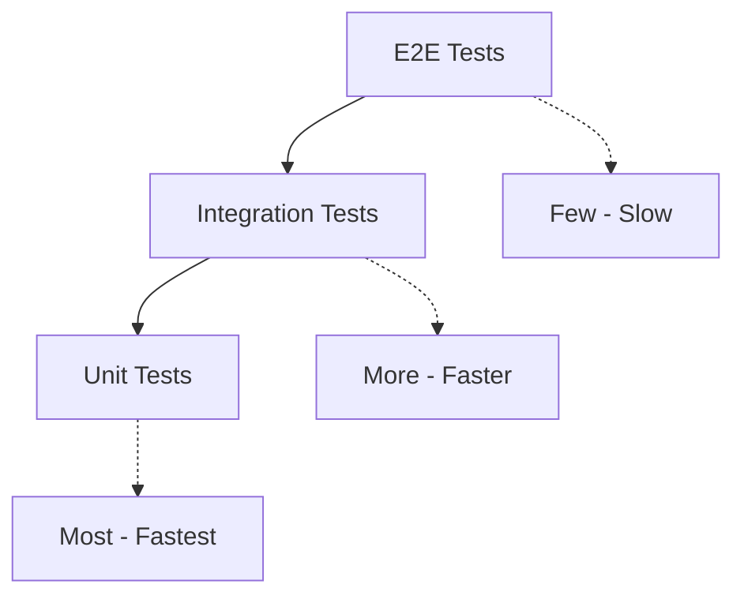

export const metadata = {
  title: 'Testing, Deployment và Launch Shopify App - Hướng dẫn chi tiết',
  description: 'Hướng dẫn testing, CI/CD setup, deployment và submit app lên Shopify App Store.',
}

# Testing, Deployment và Launch Shopify App

## Giới thiệu

Chúc mừng! Bạn đã gần hoàn thành app. Bài viết cuối cùng này sẽ hướng dẫn testing, deployment và submit app lên App Store.

---

## Testing Strategy

### Pyramid Approach



### Unit Testing

**Test individual functions/components**

```typescript
// app/repositories/__tests__/config.repository.test.ts
import { describe, it, expect, beforeEach } from "vitest";
import { configRepository } from "../config.repository";
import { Config } from "../../models/config.model";

describe("Config Repository", () => {
  const testShop = "test.myshopify.com";

  beforeEach(async () => {
    await Config.deleteMany({});
  });

  it("should create new config", async () => {
    const config = await configRepository.findOrCreate(testShop);

    expect(config).toBeDefined();
    expect(config.shop).toBe(testShop);
    expect(config.settings.enabled).toBe(false);
  });

  it("should find existing config", async () => {
    // Create first
    await configRepository.findOrCreate(testShop);

    // Find again
    const found = await configRepository.findByShop(testShop);

    expect(found).not.toBeNull();
    expect(found.shop).toBe(testShop);
  });

  it("should update settings", async () => {
    const newSettings = {
      enabled: true,
      buttonColor: "#FF0000",
      position: "top"
    };

    await configRepository.updateSettings(testShop, newSettings);
    const updated = await configRepository.findByShop(testShop);

    expect(updated.settings.enabled).toBe(true);
    expect(updated.settings.buttonColor).toBe("#FF0000");
    expect(updated.settings.position).toBe("top");
  });

  it("should delete config", async () => {
    await configRepository.findOrCreate(testShop);
    await configRepository.deleteByShop(testShop);

    const found = await configRepository.findByShop(testShop);
    expect(found).toBeNull();
  });
});
```

### Integration Testing

**Test API endpoints**

```typescript
// app/routes/__tests__/api.config.test.ts
import { describe, it, expect } from "vitest";
import { createRemixStub } from "@remix-run/testing";
import { json } from "@remix-run/node";

import { loader, action } from "../api.config";

describe("API Config Endpoint", () => {
  it("should return config for GET request", async () => {
    const request = new Request("http://localhost:3000/api/config", {
      method: "GET",
      headers: {
        "X-Shopify-Shop-Domain": "test.myshopify.com"
      }
    });

    const response = await loader({ request });
    const data = await response.json();

    expect(response.status).toBe(200);
    expect(data).toHaveProperty("settings");
  });

  it("should update config for POST request", async () => {
    const formData = new FormData();
    formData.append("buttonColor", "#FF0000");
    formData.append("position", "top");

    const request = new Request("http://localhost:3000/api/config", {
      method: "POST",
      body: formData
    });

    const response = await action({ request });
    const data = await response.json();

    expect(data.success).toBe(true);
  });

  it("should reject invalid color", async () => {
    const formData = new FormData();
    formData.append("buttonColor", "invalid");

    const request = new Request("http://localhost:3000/api/config", {
      method: "POST",
      body: formData
    });

    const response = await action({ request });

    expect(response.status).toBe(400);
  });
});
```

### E2E Testing với Playwright

```typescript
// tests/e2e/app.spec.ts
import { test, expect } from "@playwright/test";

test.describe("Admin UI", () => {
  test.beforeEach(async ({ page }) => {
    // Login to app
    await page.goto("http://localhost:3456/app");
    await page.waitForLoadState("networkidle");
  });

  test("should display dashboard", async ({ page }) => {
    await expect(page.locator("h1")).toContainText("Dashboard");
  });

  test("should save config", async ({ page }) => {
    // Navigate to customizer
    await page.click("text=Customizer");

    // Change color
    await page.click('[data-testid="color-picker"]');
    await page.fill('[data-testid="color-input"]', "#FF0000");

    // Click save
    await page.click("text=Save Changes");

    // Verify success toast
    await expect(page.locator(".toast")).toContainText("Settings saved");
  });

  test("should display preview", async ({ page }) => {
    await page.goto("http://localhost:3456/app/customizer");

    const preview = page.locator('[data-testid="preview-panel"]');
    await expect(preview).toBeVisible();

    const button = preview.locator("button");
    await expect(button).toHaveCSS("background-color", "rgb(0, 0, 0)");
  });
});
```

### Test Configuration

**vitest.config.ts:**
```typescript
import { defineConfig } from "vitest/config";

export default defineConfig({
  test: {
    globals: true,
    environment: "node",
    setupFiles: "./app/__tests__/setup.ts",
    coverage: {
      provider: "v8",
      reporter: ["text", "html", "lcov"],
      exclude: [
        "node_modules/",
        "app/__tests__/",
        "**/*.test.ts",
        "**/*.spec.ts"
      ],
      thresholds: {
        lines: 70,
        functions: 70,
        branches: 70,
        statements: 70
      }
    }
  }
});
```

**package.json scripts:**
```json
{
  "scripts": {
    "test": "vitest run",
    "test:watch": "vitest",
    "test:coverage": "vitest run --coverage",
    "test:e2e": "playwright test"
  }
}
```

---

## CI/CD với GitHub Actions

### Workflow Configuration

**.github/workflows/test.yml:**
```yaml
name: Test

on:
  push:
    branches: [main]
  pull_request:

jobs:
  test:
    runs-on: ubuntu-latest

    services:
      mongodb:
        image: mongo:7.0
        ports:
          - 27017:27017

      redis:
        image: redis:7.0
        ports:
          - 6379:6379

    steps:
      - name: Checkout
        uses: actions/checkout@v4

      - name: Setup pnpm
        uses: pnpm/action-setup@v2
        with:
          version: 8

      - name: Setup Node.js
        uses: actions/setup-node@v4
        with:
          node-version: "20"
          cache: "pnpm"

      - name: Install dependencies
        run: pnpm install --frozen-lockfile

      - name: Run linter
        run: pnpm lint

      - name: Run tests
        run: pnpm test
        env:
          TEST_MONGODB_URL: mongodb://localhost:27017/test
          TEST_REDIS_URL: redis://localhost:6379

      - name: Upload coverage
        uses: codecov/codecov-action@v3
```

### Deployment Workflow

**.github/workflows/deploy.yml:**
```yaml
name: Deploy

on:
  push:
    branches: [main]
    paths: ["app/**", "packages/**"]

jobs:
  deploy:
    runs-on: ubuntu-latest
    steps:
      - name: Checkout
        uses: actions/checkout@v4

      - name: Deploy to Fly.io
        uses: superfly/flyctl-actions/setup-flyctl@master

      - name: Deploy app
        run: flyctl deploy --remote-only
        env:
          FLY_API_TOKEN: ${{ secrets.FLY_API_TOKEN }}
```

---

## Deployment Options

### 1. Fly.io (Recommended)

**Setup:**
```bash
# Install Fly CLI
curl -L https://fly.io/install.sh | sh

# Login
fly auth login

# Launch app
fly launch

# Deploy
fly deploy
```

**fly.toml:**
```toml
app = "your-app-name"
primary_region = "sjc"

[build]
  [build.command]
    cmd = "pnpm run build"
    target = "server"

[env]
  PORT = "8080"

[[services]]
  protocol = "tcp"
  internal_port = 8080

  [[services.ports]]
    port = 80
    handlers = ["http"]

  [[services.ports]]
    port = 443
    handlers = ["tls", "http"]

[processes]
  app = "node server/index.js"
```

### 2. Railway

```bash
# Install CLI
npm install -g @railway/cli

# Login
railway login

# Initialize
railway init

# Deploy
railway up
```

### 3. Vercel

**vercel.json:**
```json
{
  "buildCommand": "pnpm run build",
  "devCommand": "pnpm run dev",
  "installCommand": "pnpm install",
  "framework": "remix",
  "functions": {
    "app/routes/**": {
      "maxDuration": 30
    }
  }
}
```

---

## Pre-Launch Checklist

### Code Quality

- [ ] All tests passing
- [ ] Coverage >70%
- [ ] Linter clean
- [ ] Typescript no errors
- [ ] No console.log in production

### Security

- [ ] Environment variables secured
- [ ] No hardcoded secrets
- [ ] HTTPS enabled
- [ ] CORS configured
- [ ] Rate limiting implemented
- [ ] Input validation on all endpoints

### Performance

- [ ] Bundle size optimized
- [ ] Images optimized
- [ ] Lazy loading implemented
- [ ] Caching strategy in place
- [ ] Database indexes configured

### Documentation

- [ ] README updated
- [ ] API documented
- [ ] User guide written
- [ ] Installation instructions

---

## App Store Submission

### 1. App Listing

**Required Information:**
- App name (unique, descriptive)
- Category (Marketing, Sales, etc.)
- Short description (60 characters)
- Long description (unlimited)
- Screenshots (at least 2)
- App icon (128x128px)
- Banner (640x480px)

**Tips:**
- Use clear, benefit-focused language
- Highlight key features
- Include video demo (optional but recommended)
- Show actual app screenshots, not mockups

### 2. Pricing Strategy

```typescript
// Pricing tiers example
const pricingTiers = [
  {
    name: "Free",
    price: 0,
    features: [
      "Basic features",
      "100 orders/month",
      "Email support"
    ]
  },
  {
    name: "Starter",
    price: 9.99,
    interval: "month",
    features: [
      "All features",
      "1,000 orders/month",
      "Priority support",
      "Custom branding"
    ]
  },
  {
    name: "Pro",
    price: 29.99,
    interval: "month",
    features: [
      "Everything in Starter",
      "Unlimited orders",
      "Dedicated support",
      "White-label option",
      "API access"
    ]
  }
];
```

### 3. Privacy Policy

**Required sections:**
- Data collected
- How data is used
- Third-party services
- Data retention
- User rights

**Shopify template:** Use [Shopify Privacy Policy Generator](https://www.shopify.com/tools/privacy-policy-generator)

### 4. Review Process

**Timeline:**
1. Submit app
2. Automated checks (1-2 days)
3. Manual review (5-10 business days)
4. Approval or feedback

**Common rejection reasons:**
- Security vulnerabilities
- Privacy policy missing
- Broken functionality
- Violation of guidelines
- Poor UX

---

## Post-Launch Monitoring

### Error Tracking

```typescript
// Sentry integration
import * as Sentry from "@sentry/remix";

Sentry.init({
  dsn: process.env.SENTRY_DSN,
  environment: process.env.NODE_ENV,
  tracesSampleRate: 0.1
});
```

### Analytics

```typescript
// Track app usage
export async function trackEvent(shop: string, event: string, data: any) {
  await analyticsRepository.track({
    shop,
    event,
    data,
    timestamp: new Date()
  });
}

// Usage
await trackEvent(shop, "app_installed", { plan: "free" });
await trackEvent(shop, "feature_used", { feature: "customizer" });
```

### Health Checks

```tsx
// app/routes/api.health.tsx
export const loader = async () => {
  const checks = {
    database: await checkDatabase(),
    redis: await checkRedis(),
    shopify: await checkShopifyAPI()
  };

  const isHealthy = Object.values(checks).every(v => v);

  return json(
    { status: isHealthy ? "healthy" : "unhealthy", checks },
    { status: isHealthy ? 200 : 503 }
  );
};
```

---

## Maintenance & Updates

### Version Management

```bash
# Semantic versioning
1.0.0 → 1.0.1 (patch - bug fix)
1.0.0 → 1.1.0 (minor - new feature)
1.0.0 → 2.0.0 (major - breaking change)
```

### Release Process

```bash
# 1. Create release branch
git checkout -b release/v1.0.0

# 2. Update version
npm version patch/minor/major

# 3. Test thoroughly
pnpm test

# 4. Deploy
pnpm deploy

# 5. Tag release
git tag -a v1.0.0 -m "Release v1.0.0"
git push origin v1.0.0
```

---

## Key Takeaways

1. **Testing pyramid** - Unit > Integration > E2E
2. **CI/CD** - Automate tests and deployment
3. **Coverage** - Aim for >70%
4. **App Store** - Follow guidelines strictly
5. **Monitoring** - Track errors and analytics post-launch

---

## Congratulations! 🎉

Bạn đã hoàn thành series "Hướng dẫn phát triển Shopify App từ A đến Z".

### What You've Learned

✅ Part 1: Shopify App ecosystem
✅ Part 2: Setup development environment
✅ Part 3: Create first project
✅ Part 4: Authentication & authorization
✅ Part 5: Build Admin UI with Polaris
✅ Part 6: Database design with MongoDB
✅ Part 7: Shopify API integration
✅ Part 8: Theme extensions & web components
✅ Part 9: Webhooks & background jobs
✅ Part 10: Testing, deployment & launch

### Next Steps

1. **Build your first app** - Apply what you've learned
2. **Join community** - Connect with other developers
3. **Keep learning** - Shopify updates regularly
4. **Get feedback** - Test with real merchants

### Resources

- [Shopify Dev Documentation](https://shopify.dev/docs/apps)
- [Shopify Community Forums](https://community.shopify.com/c/shopify-apps)
- [Shopify Discord](https://discord.gg/shopify)
- [Shopify App Requirements](https://partners.shopify.com/marketplace/app_requirements)

Chúc bạn thành công trong hành trình phát triển Shopify App! 🚀

---

[← Quay lại Phần 9: Webhooks](/blog/shopify-webhooks-background-jobs)
