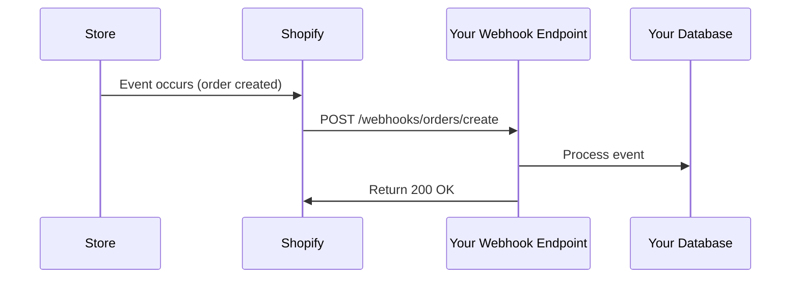

export const metadata = {
  title: 'Shopify Webhooks và Background Jobs - Hướng dẫn chi tiết',
  description: 'Hướng dẫn xử lý webhooks, background jobs và cron tasks trong Shopify App.',
}

# Shopify Webhooks và Background Jobs

## Giới thiệu

Webhooks cho phép app nhận real-time notifications về events trong store. Bài viết này sẽ hướng dẫn xử lý webhooks và background jobs hiệu quả.

---

## Webhook Fundamentals

### What are Webhooks?

**Webhooks** là HTTP POST requests Shopify gửi đến app khi có events xảy ra.



### Common Webhooks

| Topic | Description | Use case |
|-------|-------------|----------|
| `app/uninstalled` | App uninstalled | Cleanup data |
| `orders/create` | New order | Sync to external system |
| `orders/updated` | Order updated | Update tracking |
| `products/create` | New product | Index in search |
| `products/update` | Product updated | Sync inventory |
| `customers/create` | New customer | Add to CRM |

---

## Register Webhooks

### Using CLI

```bash
shopify app generate webhook
```

CLI sẽ prompt:
```
? Which webhook topics would you like to subscribe to?
❯ app/uninstalled
  orders/create
  orders/updated
  products/create
```

### Manual Registration

```typescript
// app/shopify.server.ts
const shopify = shopifyApp({
  // ... other config
  webhooks: {
    APP_UNINSTALLED: {
      deliveryMethod: "http",
      callbackUrl: "/webhooks/app/uninstalled",
    },
  },
});
```

### Using Admin API

```typescript
const response = await admin.graphql(`
  mutation webhookSubscriptionCreate {
    webhookSubscriptionCreate(
      topic: APP_UNINSTALLED
      webhookSubscription: {
        callbackUrl: "https://your-app.com/webhooks/app/uninstalled"
        format: JSON
      }
    ) {
      webhookSubscription {
        id
      }
      userErrors {
        field
        message
      }
    }
  }
`);
```

---

## Webhook Handlers

### Basic Pattern

```tsx
// app/routes/webhooks.app.uninstalled.tsx
import { json, type ActionFunctionArgs } from "@remix-run/node";
import { authenticate } from "../shopify.server";
import * as configRepository from "../repositories/config.repository";
import * as storeRepository from "../repositories/store.repository";

export async function action({ request }: ActionFunctionArgs) {
  // authenticate.webhook tự động verify HMAC
  const { topic, shop, session, admin } = await authenticate.webhook(request);

  if (topic === "APP_UNINSTALLED") {
    // Cleanup app data
    await configRepository.deleteByShop(shop);
    await storeRepository.markUninstalled(shop);

    console.log(`App uninstalled for ${shop}`);

    return json({ success: true });
  }

  return json({ success: false }, { status: 400 });
}
```

### Order Created Handler

```tsx
// app/routes/webhooks.orders.create.tsx
export async function action({ request }: ActionFunctionArgs) {
  const { topic, shop, admin, session } = await authenticate.webhook(request);

  if (topic === "ORDERS_CREATE") {
    const body = await request.json();

    // Extract order data
    const order = body;
    const orderId = order.id;
    const orderNumber = order.order_number;
    const customerEmail = order.customer?.email;
    const totalPrice = order.total_price;

    // Sync đến external system
    await syncOrderToCRM({
      shop,
      orderId,
      orderNumber,
      customerEmail,
      totalPrice
    });

    // Send notification
    await sendNewOrderNotification({
      shop,
      orderNumber,
      totalPrice
    });

    return json({ success: true });
  }

  return json({ success: false }, { status: 400 });
}
```

---

## HMAC Verification

Shopify signs webhook requests với HMAC để verify authenticity.

### Built-in Verification

```typescript
// authenticate.webhook() tự động verify HMAC
const { topic, shop } = await authenticate.webhook(request);
```

### Manual Verification

```typescript
import crypto from "crypto";

function verifyWebhookRequest(
  body: string,
  hmacHeader: string,
  webhookSecret: string
): boolean {
  const calculatedHmac = crypto
    .createHmac("sha256", webhookSecret)
    .update(body, "utf8")
    .digest("base64");

  // Compare timing-safe
  return crypto.timingSafeEqual(
    Buffer.from(calculatedHmac),
    Buffer.from(hmacHeader)
  );
}

// Usage
export async function action({ request }: ActionFunctionArgs) {
  const rawBody = await request.text();
  const hmacHeader = request.headers.get("X-Shopify-Hmac-Sha256");

  if (!verifyWebhookRequest(rawBody, hmacHeader, process.env.WEBHOOK_SECRET)) {
    return json({ error: "Invalid HMAC" }, { status: 401 });
  }

  const data = JSON.parse(rawBody);
  // Process webhook...
}
```

---

## Background Jobs

### For Long-running Tasks

Webhooks must respond quickly (<5 seconds). Use background jobs cho heavy processing.

```typescript
// app/services/job-queue.service.ts
import { Queue, Worker } from "bullmq";
import { redis } from "../redis.server";

// Create queue
const jobQueue = new Queue("webhook-jobs", {
  connection: redis
});

// Add job to queue
export async function addOrderSyncJob(orderId: string, shop: string) {
  await jobQueue.add(
    "sync-order",
    { orderId, shop },
    {
      attempts: 3,
      backoff: {
        type: "exponential",
        delay: 1000
      }
    }
  );
}

// Process jobs
const worker = new Worker(
  "webhook-jobs",
  async (job) => {
    const { orderId, shop } = job.data;

    // Do heavy processing
    await syncOrderToCRM(orderId, shop);
  },
  { connection: redis }
);
```

### Usage in Webhook

```typescript
export async function action({ request }: ActionFunctionArgs) {
  const { topic, shop } = await authenticate.webhook(request);

  if (topic === "ORDERS_CREATE") {
    const body = await request.json();

    // Queue job instead of processing immediately
    await addOrderSyncJob(body.id, shop);

    // Respond immediately
    return json({ success: true });
  }
}
```

---

## Cron Jobs

### Scheduled Tasks

```tsx
// app/routes/api.cron.analytics.tsx
import { json, type ActionFunctionArgs } from "@remix-run/node";

export async function action({ request }: ActionFunctionArgs) {
  // Verify cron secret
  const authHeader = request.headers.get("authorization");
  if (authHeader !== `Bearer ${process.env.CRON_SECRET}`) {
    return json({ error: "Unauthorized" }, { status: 401 });
  }

  // Run daily analytics aggregation
  const shops = await storeRepository.getAllActive();

  const results = [];
  for (const shop of shops) {
    const dailyStats = await aggregateDailyStats(shop);
    results.push({ shop: shop.shop, stats: dailyStats });
  }

  return json({
    success: true,
    processed: results.length,
    results
  });
}

// Setup cron job (external)
// 0 2 * * * curl -X POST https://your-app.com/api/cron/analytics \
//   -H "Authorization: Bearer YOUR_CRON_SECRET"
```

### With Shopify CLI

```bash
# Create cron job
shopify app generate cron

# Cron job route created at app/routes/api.cron.tsx
```

---

## Error Handling & Retries

### Retry Logic

```typescript
export async function action({ request }: ActionFunctionArgs) {
  const { topic } = await authenticate.webhook(request);

  if (topic === "ORDERS_CREATE") {
    try {
      await processOrder(await request.json());
      return json({ success: true });
    } catch (error) {
      // Log error
      console.error("Webhook processing failed:", error);

      // Return 5xx để Shopify retry
      // Shopify sẽ retry với exponential backoff
      return json(
        { error: "Processing failed" },
        { status: 503 }
      );
    }
  }
}
```

### Retry Schedule

| Response | Action |
|----------|--------|
| 200-299 | Success - don't retry |
| 400-499 | Client error - don't retry |
| 500-599 | Server error - retry with backoff |

**Retry intervals:**
- Attempt 1: Immediately
- Attempt 2: ~2 seconds later
- Attempt 3: ~10 seconds later
- Attempt 4: ~1 hour later
- Attempt 5: ~12 hours later
- Attempt 6+: ~24 hours later

---

## Testing Webhooks

### Local Testing

```bash
# Start dev server
shopify app dev

# CLI provides ngrok URL
# Use it in Shopify webhook configuration
```

### With Shopify CLI

```bash
# Trigger test webhook
shopify webhook trigger
```

### Manual Testing

```bash
# Send test webhook
curl -X POST https://your-app.com/webhooks/orders/create \
  -H "Content-Type: application/json" \
  -H "X-Shopify-Topic: orders/create" \
  -H "X-Shopify-Hmac-Sha256: CALCULATED_HMAC" \
  -d '{"id": "gid://shopify/Order/123", ...}'
```

---

## Monitoring

### Log Webhook Deliveries

```typescript
export async function action({ request }: ActionFunctionArgs) {
  const { topic, shop } = await authenticate.webhook(request);

  const startTime = Date.now();

  try {
    await processWebhook(await request.json());

    const duration = Date.now() - startTime;

    // Log success
    await logWebhookEvent({
      shop,
      topic,
      status: "success",
      duration
    });

    return json({ success: true });
  } catch (error) {
    const duration = Date.now() - startTime;

    // Log error
    await logWebhookEvent({
      shop,
      topic,
      status: "error",
      duration,
      error: error.message
    });

    throw error;
  }
}
```

### Dashboard

```tsx
// Admin UI để xem webhook status
export const loader = async ({ request }: LoaderFunctionArgs) => {
  const { session } = await authenticate.admin(request);

  const webhookStats = await getWebhookStats(session.shop);

  return json(webhookStats);
};

export default function WebhookDashboard() {
  const { stats } = useLoaderData<typeof loader>();

  return (
    <Page title="Webhook Status">
      <Card>
        <BlockStack gap="400">
          <Text>Total Webhooks: {stats.total}</Text>
          <Text tone="success">Success: {stats.success}</Text>
          <Text tone="critical">Failed: {stats.failed}</Text>
          <Text>Average Duration: {stats.avgDuration}ms</Text>
        </BlockStack>
      </Card>
    </Page>
  );
}
```

---

## Best Practices

### 1. Quick Response

```typescript
// ❌ BAD - Long processing
export async function action({ request }) {
  const data = await request.json();

  await heavyProcessing(data); // Takes 10 seconds

  return json({ success: true });
}

// ✅ GOOD - Queue job
export async function action({ request }) {
  const data = await request.json();

  await queueJob(data); // Returns immediately

  return json({ success: true });
}
```

### 2. Idempotency

```typescript
// Handle duplicate webhooks
const processedWebhooks = new Set();

export async function action({ request }) {
  const { topic, shop } = await authenticate.webhook(request);
  const body = await request.json();
  const webhookId = body.admin_graphql_api_id;

  // Check if already processed
  if (processedWebhooks.has(webhookId)) {
    return json({ success: true, message: "Already processed" });
  }

  await processWebhook(body);
  processedWebhooks.add(webhookId);

  return json({ success: true });
}
```

### 3. Graceful Degradation

```typescript
try {
  await criticalOperation(data);
} catch (error) {
  // Log nhưng không fail webhook
  console.error("Operation failed:", error);
  await notifySupport(error);
}

// Always return success
return json({ success: true });
```

---

## Key Takeaways

1. **Webhooks** - Real-time event notifications
2. **HMAC verification** - Built-in with authenticate.webhook()
3. **Background jobs** - Queue heavy processing
4. **Quick response** - Respond <5 seconds
5. **Retries** - Return 5xx for automatic retry

---

## Next Steps

Trong **Phần 10**, bạn sẽ học:
- Testing strategies
- CI/CD setup
- Deployment options
- App Store submission

[Đọc Phần 10: Testing, Deployment & Launch →](/blog/shopify-app-testing-deployment)

[← Quay lại Phần 8: Theme Extensions](/blog/shopify-theme-extensions)
